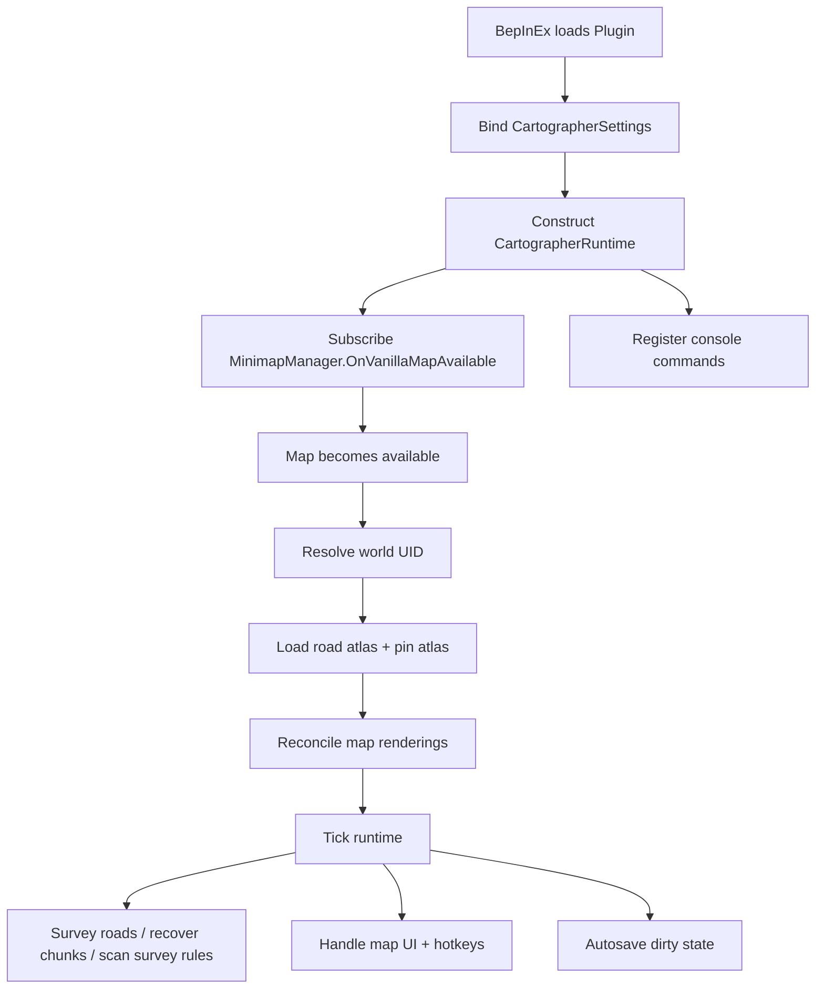
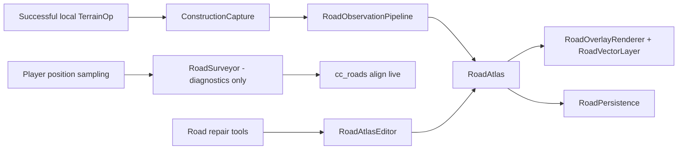
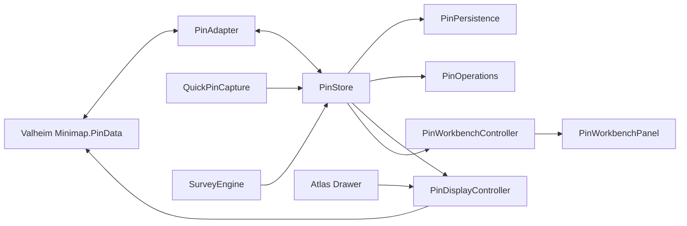
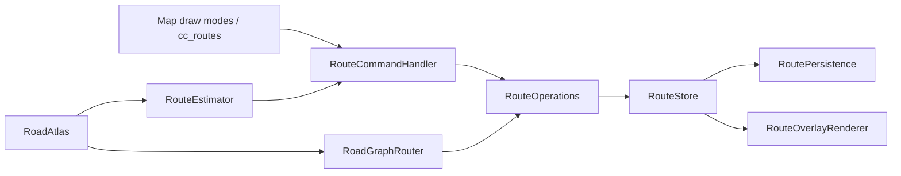
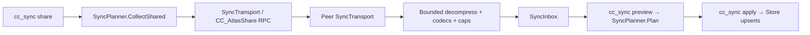

# Concerned Cartographer — Codebase Guide

> **Audience:** maintainers, contributors, reviewers, and anyone trying to understand or extend the mod.
>
> **Snapshot:** originally written against 0.4.0; updated for the Concerned Cartographer **1.0-line release candidates** (repository `main`, RC lineage commit `53f371c60da8b6b5b69d590b918657d0ecbe4026`), whose public package identity ships as **0.9.0 (Public Beta)** since RC13. Sections 8b–8e cover the v0.5–v1.0 additions (routes, collaboration/sync, localization/accessibility, compatibility/backup, and the SEC-1.0-001 hardening layer). This document remains a living map: update it in the same PR whenever source files or responsibilities change.

## 1. Architectural model

Concerned Cartographer is a single BepInEx/Jötunn plugin DLL targeting .NET Framework 4.8.

The code intentionally separates four kinds of responsibilities:

1. **Pure domain logic** — roads, pins, search, clustering, serialization rules, undo/redo. These classes do not depend on Unity or Valheim and can be unit-tested outside the game.
2. **Game adapters** — classes that read Valheim terrain, map pins, loaded objects, world identity, and construction events.
3. **Presentation adapters** — map overlays and Jötunn/Unity UI.
4. **Persistence/runtime orchestration** — world switching, sidecar files, autosave, commands, lifecycle and fail-closed behavior.

The most important design rule is:

> **Valheim-specific internals belong at the edges. Domain logic should not know what `Minimap`, `Heightmap`, `TerrainComp`, BepInEx, Jötunn, or Unity are.**

This keeps game-version breakage localized and makes AI-assisted code easier to review.

## 2. High-level data flow

### Plugin lifecycle



### Road flow



**RC8 STRICT ROAD SOURCE AUTHORITY**: only successful explicit LOCAL
PLAYER construction (Pathen ⇒ Dirt, Paved ⇒ Paved) creates road atlas
data. The pipeline refuses Traversal/ChunkRecovery observations at the
single choke point; `RoadSurveyor` samples purely for the `align live`
diagnostic and the chunk-recovery scanner was retired. Legacy passive
strokes migrate away once at load (`.pre-authority.bak` kept), while
construction strokes survive untouched.

### Pin flow



`PinStore` owns durable identity. `Minimap.PinData` is only a rendering/adoption surface.

### Route flow (v0.5+)



### Sync flow (v0.6+)



Nothing received over the network is ever applied automatically: every envelope lands in the inbox and goes through an explicit preview/apply step.

## 3. Repository layout

```text
ConcernedCatMods/
├─ ConcernedCatMods.sln
├─ Directory.Build.props
├─ DoPrebuild.props
├─ Environment.props.example
├─ scripts/
├─ tools/
├─ docs/
│  └─ mods/
│     └─ concerned-cartographer/
├─ src/
│  ├─ ConcernedCartographer/
│  │  ├─ Domain/
│  │  ├─ Map/
│  │  ├─ Persistence/
│  │  ├─ Roads/
│  │  ├─ Runtime/
│  │  ├─ Package/
│  │  └─ Plugin.cs
│  └─ ConcernedCartographer.Tests/
└─ .github/
```

The shipped plugin remains **one DLL**. The pure domain sources are compiled directly into the test project, so tests can run without shipping a second domain assembly.

## 4. Entry point and runtime orchestration

### `Plugin.cs`

**Role:** BepInEx entry point and lifecycle shell.

Responsibilities:

- declares plugin GUID, name, and version;
- declares Jötunn dependency;
- binds configuration;
- creates `CartographerRuntime`;
- subscribes to Jötunn's vanilla-map-available event;
- registers `cc_roads`, `cc_pins`, `cc_atlas`, `cc_survey`, `cc_routes`, and `cc_sync`;
- forwards Unity `Update` ticks;
- triggers final persistence on quit/destroy;
- logs environment versions and effective configuration.

Do not put terrain detection, persistence formats, road geometry, or pin business rules here.

### `Runtime/CartographerRuntime.cs`

**Role:** central application coordinator.

This is intentionally the busiest integration class. It wires together the current world, domain stores, adapters, UI, persistence and runtime scanners.

It currently coordinates:

- `RoadPersistence`
- `PinPersistence`
- `GroundPaintProbe`
- `RoadOverlayRenderer`
- `ConstructionCapture`
- `ChunkRecoveryScanner`
- `RoadObservationPipeline`
- `RoadAtlas`
- `RoadAtlasEditor`
- `RoadSurveyor`
- `PinStore`
- `PinAdapter`
- `PinCommandHandler`
- `PinWorkbenchPanel`
- `PinDisplayController`
- `AtlasDrawerPanel`
- `SavedViewStore` / persistence
- `QuickPinCapture`
- `SurveyEngine`
- `SurveyScanner`
- `SurveyRulePersistence`
- `RouteStore` / `RoutePersistence` / `RouteOperations` / `RouteCommandHandler`
- `RouteOverlayRenderer`
- `RoadGraphRouter` / `RouteEstimator`
- `AuthorIdentity` / `SyncTransport` / `SyncInbox`
- `CompatibilityRegistry`
- `AtlasBackupTools`
- `AtlasStrings` / `LocalizationPersistence`

Major lifecycle responsibilities:

1. resolve active world UID;
2. switch persistence state on world change;
3. load/maintain roads and pins;
4. recreate overlays and managed pin renderings when the map is ready;
5. tick traversal, chunk recovery and survey scanning;
6. process map hotkeys/panels;
7. autosave;
8. end active strokes and flush data on logout/world switch;
9. debounce full road redraws after destructive terrain reconciliation.

**Maintainer warning:** new deterministic algorithms should usually be extracted from this class. It is an orchestration layer, not a dumping ground.

### `Runtime/CartographerSettings.cs`

**Role:** single home for BepInEx config bindings.

Current settings cover:

- master enable;
- construction capture;
- terrain reconciliation;
- loaded-chunk recovery and budget;
- road sample interval/spacing/gap/suppression;
- autosave;
- terrain paint threshold/sample radius;
- road line width;
- diagnostics/calibration;
- Pin Workbench and Atlas Drawer hotkeys/preferences;
- quick-pin hotkey/radius;
- Survey Rules enable/cadence/radius/base exclusion/max observations;
- routes: draw modifier, erase/snap radii, on-road tolerance, travel speeds (v0.5);
- accessibility: UI scale, high-contrast ink palettes, gamepad open buttons (v0.7).

New configuration should be bound here rather than read directly from `ConfigFile` by arbitrary feature classes.

### `Runtime/WorldContext.cs`

Tiny adapter for resolving the active Valheim world UID. Per-world storage should key off UID, not display name.

### `Runtime/RateLimitedLog.cs`

Prevents retrying failures (disk/reflection/runtime) from flooding `LogOutput.log`.

## 5. Road domain (`Domain/`)

Namespace: `TheConcernedCat.ConcernedCartographer.Roads`.

### `RoadKind.cs`

Road-type enum. Current kinds: Dirt and Paved.

### `RoadPoint.cs`

Game-independent world coordinate value. Provides horizontal-distance semantics used by roads and pins.

### `RoadSegment.cs`

One newly created drawable segment. Allows incremental rendering instead of rebuilding the entire overlay after every sample.

### `RoadStroke.cs`

One road polyline:

- stable `Guid`;
- `RoadKind`;
- `RoadObservationSource` provenance;
- ordered point list;
- hidden flag for repair tools.

### `RoadSamplingRules.cs`

Bundles minimum spacing, maximum gap and duplicate-suppression values so all observation sources use shared semantics.

### `RoadObservationSource.cs`

Provenance for road knowledge. Current sources are Traversal, Construction and ChunkRecovery.

### `RoadObservation.cs`

Source-neutral ingestion payload: source + kind + position.

### `RoadObservationPipeline.cs`

Single entry point for road creation.

Guarantees:

- **road source authority (RC8)**: observations from any source other
  than `Construction` are refused outright and end that source's stroke —
  the strict v1 product rule enforced at one choke point;
- exact-replay idempotency for the accepted source;
- per-source active stroke isolation;
- negative terrain intent (DEF-v1.0-005) retained as defense in depth for
  any future non-construction source.

New road observers should feed this pipeline rather than write directly to `RoadAtlas` or the map — and must NOT be passive sources without a new product decision.

### `RoadAtlas.cs`

**Core road state machine.**

Owns:

- all strokes;
- per-source active strokes;
- dirty state;
- duplicate-suppression spatial index;
- append/gap/kind-change rules;
- coverage removal;
- maintenance;
- nearest-stroke queries;
- structural edit hatch used by repair tools.

Important invariants:

- duplicate suppression is **segment-based**, not point-only;
- newest active-stroke tail is exempt from self-suppression;
- maximum-gap violation starts a new stroke, never a connector;
- sources are independent;
- destructive edits rebuild the spatial index;
- coverage removal may split a stroke while preserving the first surviving run's identity.

Load-time maintenance currently:

- merges compatible endpoints within a small tolerance;
- Douglas–Peucker simplifies within 1 m horizontal tolerance.

Do not mutate `Strokes` from random callers. Use `EditStrokes` or a dedicated domain method.

### `RoadGeometry.cs`

Pure geometry helpers such as point-to-segment distance and polyline simplification.

Math belongs here rather than in Unity/map adapters.

### `RoadAtlasEditor.cs`

Pure road correction tools:

- nearest-road delete;
- Dirt/Paved reclassification;
- hide/unhide;
- split;
- join;
- bounded undo;
- nearest-road description.

All operations mutate through `RoadAtlas.EditStrokes` so indexes/dirty state stay coherent.

### `RoadAtlasCodec.cs`

Pure parser/writer for versioned road TSV rows. Filesystem behavior belongs in `RoadPersistence`.

### `RecoveryShapeHeuristic.cs`

Pure old-road recovery heuristic that favors path-like painted neighborhoods and rejects broad pads/plazas. It is testable because recovery false positives are a product risk.

### `TerrainIntentMask.cs` (DEF-v1.0-005)

Persistent negative terrain intent for one world: a bounded set of 1 m ground cells the player explicitly terraformed (Level/Raise/Cultivate/Reset), where dirt paint is a side effect and must never be recorded as road. `RoadObservationPipeline` refuses Dirt observations from the passive sources (traversal, chunk recovery) inside the mask and ends the active stroke so no connector crosses the pad; Construction is never gated, and a deliberate Pathen/Paved clears the cells its brush covers. Bounded at 250k cells with oldest-first eviction; derives only from the local player's own operations (no unexplored-world reveal).

### `TerrainIntentCodec.cs`

Pure parser/writer for the versioned `cc-terrain-intent v1` sidecar rows. Malformed rows are skipped and counted; an unknown header loads empty (documented derived-data downgrade). Filesystem behavior belongs in `TerrainIntentPersistence`.

## 6. Road game adapters (`Roads/`)

### `GroundPaintProbe.cs`

**Narrow Valheim terrain-paint adapter.**

It finds loaded `Heightmap` data, converts world position to paint-mask position, samples a configurable neighborhood and classifies Dirt/Paved/no-road.

If a Valheim update changes terrain internals, fix this adapter first instead of spreading paint-mask knowledge across the codebase.

### `RoadSurveyor.cs`

Diagnostics-only traversal sampler (RC8). On a configured cadence it
probes the terrain beneath the local player and records whether recorded
road geometry sits nearby — feeding only `cc_roads align live`
(`LatestSample`). It never creates road data.

### `TerrainActionClassifier.cs` / `TerrainActionCategory.cs` / `TerrainActionClassification.cs` / `TerrainPaintKind.cs` (Domain, RC10, DEF-v1.0-007)

**The road source authority, identity edition.** Pure and fully tested
(`TerrainActionClassifierTests`): a captured operation is classified by
the ACTUAL player action — the placed TerrainOp's prefab name
(`path_v2` = Pathen, `mud_road_v2` = Level ground: the prefab names do
NOT match the hoe menu labels), the Piece localization token as
fallback, and the selected build piece as corroboration. Settings flags
(`m_level`/`m_raise`/`m_smooth`) are deliberately NOT inputs — in the
live game Level ground and Pathen ship near-identical
smooth-and-paint-Dirt settings, which is why every flag heuristic
(RC8 and earlier) misclassified Level as road building. Only
Pathen-with-Dirt-paint and PavedRoad-with-Paved-paint produce a
`RoadKind`; everything else (Level, Raise, Cultivate, digging, unknown
ops, selection mismatches) is a non-road paint op that erases covered
ink. If a game update ever adds terrain actions, extend the prefab
table here — never re-derive authority from paint or flags.

### `CapturedTerrainOperation.cs`

Neutral value object containing the classified facts for one operation:
authorized road kind (null for every non-road action), position, brush
radius, the classified category, and the classifier's diagnostic
description line.

### `ConstructionCapture.cs`

Harmony/game adapter for successful terrain operations
(`TerrainComp.ApplyOperation` postfix — runs exactly on the placing
client, so only the local player's own actions are ever captured).

It reads the op's identity (GameObject name, Piece token, selected
piece via `Player.GetBuildSelection`), maps the paint type to the
domain `TerrainPaintKind`, delegates classification to
`TerrainActionClassifier`, and raises `CapturedTerrainOperation`.

The patch is observational. It must never mutate Valheim terrain.

Failure disables this source for the session. The runtime logs an
always-on rate-limited "Terrain action classified:" line per captured
action so any future authority regression is visible in LogOutput.log.

### Chunk recovery (retired in RC8)

The `ChunkRecoveryScanner` adapter was removed with the road source
authority rule — passive recovery of arbitrary terrain paint is exactly
what v1 forbids. `RecoveryShapeHeuristic` (pure, tested) remains in the
domain for a possible future explicit re-capture feature; any
reintroduction needs a product decision and must not feed the pipeline
passively.

## 7. Road/map rendering (`Map/`)

### `RoadOverlayRenderer.cs`

Jötunn overlay adapter for `CC Dirt Paths` and `CC Paved Roads`.

Responsibilities:

- world→overlay coordinate conversion;
- line/dot drawing;
- full redraw from `RoadAtlas`;
- incremental segment draw;
- layer enable/disable;
- calibration markers;
- safe recreation after map/world lifecycle transitions.

Destructive road edits schedule/debounce a full redraw because pixels cannot be safely “un-drawn” incrementally.

RC10 additions: overlay handles are cached (one `GetMapOverlay` per
name per session), the Jötunn per-overlay checkboxes are hooked as real
user layer switches (`OverlayUserToggleHook` + the pure
`OverlayVisibilityRule`), suppression writes re-sync the checkbox to
the USER state, and `UserToggledOverlay` lets the runtime mirror clicks
into the drawer settings.

RC14 fix 4: the handle cache is **liveness-checked** through the pure
`OverlayHandleRule` — Jötunn destroys every overlay texture on
`Minimap.OnDestroy` and clears its registry, so a handle cached in one
game session painted persisted roads into a dead texture in the next
(the beta "roads gone from the minimap after relog" report). A handle
is only trusted while its `OverlayTex` is Unity-alive; anything else
re-resolves against the current Minimap. `ResetMapSession()` (called
from the runtime's map-available path, also on `RouteOverlayRenderer`)
additionally drops both handles and un-latches the vector layer's
per-session fail-soft disable via `RoadVectorLayer.ResetSession()` —
previously that "session" latch silently lasted the whole process.

### `VectorBakeScheduler.cs` (Domain, RC11 blocker 3)

The vector layer's rebake decision as a pure, sweep-tested state
machine: first-bake, zoom-step threshold (both directions), data
debounce, periodic parity, container invalidation, and the incomplete-
bake retry (an unprojectable bake commits nothing and retries within
0.25 s — previously it cleared the dirty flag and left roads invisible
until the next zoom step or 30 s tick). Change rebake behavior HERE,
with tests, never inline in the Unity layer.

### `RoadVectorLayer.cs` (DEF-v1.0-006; routes since RC10)

The high-precision large-map vector layer for roads AND routes: one
container transform reproduces vanilla pan/zoom exactly
(`RoadVectorMath`), widths and dash/dot cadences are defined in screen
pixels and re-derived at every rebake, route stamping walks the shared
pure `RoutePatternMath` (identical geometry to the texture path), and
per-quad vertex colors let all routes share one graphic. Routes render
regardless of fog (the player's own plans); roads keep fog parity.
Styled routes that would blow the stamp budget degrade to solid lines
per route instead of taking the layer down.

### `RoadInkSoftening.cs` (Domain, RC13 polish 1)

The pure feathered-edge profile for large-map road ink: an opaque color
core, a symmetric monotonic alpha falloff, and a 4/3 quad widen factor
chosen so the 50%-alpha extent equals the crisp RC12 width exactly
(perceived width preserved). `RoadVectorLayer` samples it into one
1×64 gradient texture that dirt/paved quads stretch across their width
via per-vertex uv — same quad count and budget, no under-stroke, no
double-render; routes keep the default white texture and stay crisp.

### `RouteOverlayRenderer.cs`

The route texture overlay ("CC Routes"): minimap + fallback since RC10,
suppressed on the large map while the vector layer draws routes (same
`OverlayVisibilityRule` as roads), with its Jötunn checkbox hooked as
the route layer's user switch. Colors resolve through `RouteInk`
(shared with the vector layer); dash/dot walks `RoutePatternMath`.

### `OverlayUserToggleHook.cs` / `OverlayPanelRelabel.cs` (RC10)

The first attaches a listener to a Jötunn overlay checkbox (reflection
over the internal `Toggle` field, fail-soft) so user clicks reach CC as
layer intent, and re-syncs the checkbox visual after programmatic
Enabled writes. The second renames the panel's visible "Mod Overlays"
label to "Map Overlays" — exact-match only, remembered and restored on
disable/teardown.

### `CcTextFocus.cs` (RC10, feedback 14)

Central typing-safety state: `AnyFieldFocused()` (the runtime holds a
`ModalInputBlock` over Jötunn's `BlockInput` exactly while true, and
every CC hotkey path checks it) and `EscapeShouldOnlyBlur()` (panels
let the first Escape end typing). Nothing is intercepted when no field
is focused.

### `MinimapReflection.cs`

Centralizes reflection helpers for fragile/private `Minimap` state.

Private-member access should be kept here or in equally narrow adapters and documented with the tested Valheim version.

RC11 blocker 2 replaces RC10's single-ancestor rail discovery with
`TryGetVanillaRailContainers`: per-button-group deepest common
ancestors (five selectors; death/boss filters) with a shared-panel path
that hides only when every control is replaced, validated against the
map image, hint bars, shared-map hint, and (reflected) pin roots. The
verdict string is logged once per change by the runtime ("Vanilla rail
chrome: …") so smoke runs can see what was hidden or why a per-button
fallback ran. Restore paths unhide the containers first.

RC13 polish 3 adds `Map/OrphanChromeSweep.cs` + the pure
`Domain/Atlas/OrphanChromeRule.cs`: from every rail object CC already
hid, a bounded parent climb hides the HIGHEST ancestor the rule proves
is empty decoration (no map image / hint bars / shared-map hint / pin
roots / biome label in the subtree, no would-be-visible control, no
text-bearing graphic) — catching backplates that frame the replaced
controls from OUTSIDE both button groups, like the visible-to-others
toggle's plate. SetActive only, everything tracked and restored on any
fallback and teardown, decisions logged once per change as
"Vanilla chrome sweep: …".

`MapInputGate` also owns the RC11 blocker-7 wheel guard: a
prefix/postfix on `Minimap.UpdateMap` snapshots and restores both zoom
levels AND both uv windows while the runtime-supplied `WheelGuard`
(pointer over CC UI / CC field focused) is true, so a wheel event
scrolls only the UI. Fails soft to RC10 behavior without the zoom
fields.

## 8. Pin domain (`Domain/Atlas/`)

Namespace: `TheConcernedCat.ConcernedCartographer.Atlas`.

### `AtlasId.cs`

Stable namespaced identity independent of map-object identity.

### `AtlasPin.cs`

Durable pin entity. Current fields include:

- stable ID;
- monotonic revision;
- name;
- icon ID;
- category;
- color;
- display size;
- notes;
- tags;
- status;
- checked state;
- scope intent;
- source;
- archived flag;
- durable deletion/tombstone state;
- position;
- created/modified/deleted timestamps.

Edits mutate fields under a newer revision; they do not replace identity.

### `AtlasPinSource.cs`

Pin provenance (managed/adopted/generated/etc.). Provenance is used for safe ownership and compatibility decisions.

### `AtlasPinStatus.cs`

User-facing pin status beyond vanilla checked/unchecked.

### `AtlasScope.cs`

Sharing/scope intent (Private/Table/Server). Since v0.6 this drives sync policy: only Table/Server entities ever travel; Private entities never leave the machine (property-tested).

### `AtlasText.cs`

Escapes delimiter-dangerous free text in sidecars. Percent-encodes tabs, newlines, carriage returns, percent signs and commas.

New TSV formats containing free text should reuse this contract.

### `PinStore.cs`

**Core pin state table.**

Owns:

- stable-ID dictionary;
- create/mutate;
- revision bumps;
- durable delete/restore;
- higher-revision-wins upsert;
- tombstone enumeration/retention purge;
- dirty state;
- `Changed` event for journaling.

Critical future-sync invariant:

> Incoming state only wins when its revision is strictly newer.

### `PinCodec.cs`

Pure pin TSV serialization/parser. Snapshot and journal rows use the same full-entity representation.

### `PinOperations.cs`

Higher-level operations over `PinStore`:

- move;
- duplicate;
- archive/unarchive;
- delete/restore;
- batch edit;
- spatial duplicate detection;
- duplicate merge;
- recently deleted;
- bounded undo/redo.

Critical invariant:

> Undo/redo restores old **field values under a new revision**. Revisions never move backward.

That allows future revision-based sync to converge.

### `PinWorkbenchController.cs`

Pure edit-buffer/controller between UI/commands and domain operations.

The UI should edit a buffer, validate, then apply through controller/operations rather than directly modifying authoritative pin objects.

### `PinRenderingLedger.cs` (DEF-v1.0-004)

Pure decision core of the map pin adapter: owns the AtlasId↔rendering tracking table (generic over the rendering handle, so tests use fakes) plus every match/sync decision — `ClaimMatch` (position + exact name, each rendering claimable once; map/world reconstruction only) and `DecideSync` (targeted Add/Remove/Replace/UpdateChecked against the *tracked* rendering, so in-session edits update their own rendering instead of orphaning it and duplicating). The lifecycle regression suite lives against this class.

### `IconRegistry.cs`

Append-only registry of stable namespaced icon IDs. Every entry keeps a
vanilla pin ordinal (what the saved pin persists as — uninstall/downgrade
safety) and, for the 12 cc:* icons (RC8), a `SpriteKey` naming the
embedded CC sprite that overrides the rendering in-session.

Rules:

- never reuse an existing ID for a new meaning;
- unknown IDs are preserved even if rendered via fallback;
- append new IDs rather than reordering/renaming old ones;
- sprites are rendering-only — nothing about them is ever persisted.

### `PinQuery.cs`

Deterministic search/filter parser.

Supported forms include plain words and:

- `name:`
- `category:`
- `tag:`
- `icon:`
- `status:`
- `scope:`
- `source:`
- `is:checked|unchecked|archived|deleted`
- `near:x,z,radius`

Malformed special syntax degrades safely instead of mutating/hiding stored data permanently.

### `PinClusterer.cs`

Pure display grouping for semantic zoom. Returns singles and clusters; never mutates `PinStore`.

### `SavedView` / `SavedViewStore.cs`

Profile-level display preferences: query and layer/cluster flags. Applying a view re-evaluates live data.

### `QuickPinSuggester.cs`

Pure object-name/type → suggested pin metadata policy. Keep suggestion heuristics here instead of inside the Unity raycast adapter.

RC10 (feedback 15): the adapter passes a CANDIDATE CHAIN — hover
target, ZNetView prefab root, transform root — and the suggester picks
the first non-technical name (Collider/trigger/mesh/LOD/snap-point
style engine names are sanitized away, hover text keeps only its first
line, "Marked object" is the fallback). Keyword matching still sees
every candidate.

### `SurveyRule` / `SurveyRuleSet.cs`

Pure shareable Survey Rules format.

Rules support exact or prefix prefab patterns, blacklist patterns, icon/category suggestion, duplicate radius and expiry. Blacklist wins first; exact beats prefix; longer prefix beats shorter prefix.

### `SurveyEngine.cs`

Pure review-before-commit state for survey observations. A scan match is not automatically a permanent pin, preventing map flooding.

The Unity-side `SurveyScanner` walks a fresh loaded-instance snapshot
CONTINUOUSLY on a bounded per-tick budget since RC10 (feedback 9) —
matches surface within about a second — and coalesces the top-left
notice to one per ~10 s, only when something was collected.
`SurveyScanIntervalSeconds` is a documented no-op.

### `RoutePatternMath.cs` / `OverlayVisibilityRule.cs` (RC10)

Pure and tested: the single geometric dash/dot cadence walker both
route presentations stamp through (phase carried across vertices;
vertex density invisible; budgets respected), and the
texture-vs-vector one-presentation truth table with the honest-checkbox
rule. RC11 blocker 1: the renderers write the rule's result to
`MapOverlay.Enabled` UNCONDITIONALLY — Jötunn's own checkbox listener
writes Enabled before CC's, so any applied-state cache diverges exactly
then (the doubled-ink report); the Jötunn setter no-ops on unchanged
values, so caching is pointless anyway.

### `FreeDrawStrokeGate.cs` (Domain, RC11 blocker 4)

Pure stroke state machine for UI Free Draw: a route entity is created
only once a hold has travelled the freehand point spacing; click-
twitches and pointer-over-UI holds buffer one point and evaporate.
`RouteCommandHandler` obeys its decisions and never creates routes
directly from raw input.

### `NameHumanizer.cs` (Domain, RC11 blockers 11/14)

The one prefab-name → display-name policy (case/underscore/digit
splitting, noise-token removal, known-compound expansion). Survey
suggested names and quick-pin prefab fallbacks both route through it;
new name-bearing surfaces must too.

### `SurveyRejectedCodec.cs` + `Persistence/SurveyRejectedPersistence.cs` (RC11 blocker 9)

Pure TSV codec and per-world sidecar (`<uid>.survey-rejected.tsv`) for
the durable Rejected list; `SurveyEngine` suppresses rejected
identities (`IdentityKey` = cleaned prefab + world cell) from every
future sweep until restored/accepted. Saved on autosave, world switch,
and dispose when dirty.

## 8b. Route domain (`Domain/Atlas/`, v0.5)

### `AtlasRoute.cs`

Durable route entity (`RouteKind`, `RouteStyle`, `RouteStatus` enums live here too): stable `cc:route:<guid>` identity, monotonic revision, name/notes/color, kind (freehand/waypoint), style, status, scope, locked/archived flags, durable tombstone state, author columns and an ordered point list.

### `RouteStore.cs`

Route state table mirroring `PinStore` semantics: create/mutate under new revisions, durable delete/restore, higher-revision-wins upsert, tombstone enumeration, dirty state and a `Changed` event for journaling.

### `RouteCodec.cs`

Pure route TSV codec. Each route serializes as one meta row plus point rows, all stamped with the route's revision; parsing keeps only the highest revision per identity, so snapshot+journal replay is idempotent. Meta format v1 (17 fields) and v2 (19 fields, author columns) both parse; v2 is written.

### `RouteOperations.cs`

Freehand append (2 m spacing), erase-with-split, waypoint insert/move/remove, split/merge, lock, and bounded undo/redo that restores old values under **new** revisions (same convergence rule as pins).

### `RoadGraphRouter.cs`

Builds a graph over road-stroke points (plus ~8 m junction links) and runs bounded A* so waypoint routes can follow recorded roads.

### `RouteEstimator.cs`

Distance/on-road-share/travel-time estimates by sampling route segments against `RoadAtlas` with configured on/off-road speeds.

## 8c. Collaboration domain (`Domain/Atlas/SyncPlanner.cs`, v0.6)

One file holds the pure sync stack:

- **`SyncPolicy`** — verdict rules: only Table/Server scopes travel; a non-owner delete is rejected; equal-revision divergence is a Conflict; otherwise strictly-higher revision wins.
- **`SyncPlan`** — the preview result (new/updated/tombstone/conflict/rejected/superseded lists per family) plus `Summary()` and `DeletionNames()` — the preview must NAME what a share would delete, because author identity is labeling, not authentication.
- **`SyncPlanner`** — `CollectShared` (everything shareable including tombstones so deletions propagate), `Plan` (pure preview against local stores) and `Apply` (explicit, conflict side selectable; taking the remote side lands as a NEW local revision so both sides converge).
- **`SyncInbox`** — bounded (8 authors) peek/take review inbox. Incoming envelopes stop here; nothing auto-applies.

Property-style tests cover tombstone no-resurrection through stale clients, private-never-travels and conflict convergence.

## 8d. Hardening layer (`Domain/Atlas/`, SEC-1.0-001)

### `AtlasLimits.cs`

Structural bounds enforced at every parse boundary: revision sanity cap (1e12), finite-float checks, and graceful string truncation caps (name 200, category/icon 100, notes 10k, 64 tags × 64 chars). Applied inside `PinCodec`, `RouteCodec` and `RoadAtlasCodec`, so hostile rows cannot smuggle absurd revisions, NaN/Infinity coordinates or memory-hostile strings into the stores.

### `AtlasCompression.cs`

Bounded gzip for sync envelopes (standard format, interoperable with the game's own compression). `TryDecompress` aborts mid-stream the moment output exceeds the cap, so a decompression bomb can never balloon memory. The game's `Utils.Decompress` is unbounded — never reintroduce it on a receive path.

### `AtlasText.SanitizeDisplay`

Strips rich-text markup and control characters and caps length for any network-supplied string that reaches the HUD (author names).

## 8f. Crash reporting (`Domain/Reporting/`, #97)

Pure, provider-abstracted crash reporting: `ICrashReporter`
(Initialize/CaptureException/CaptureFatalSubsystemFailure/Flush/Dispose)
with `NullCrashReporter` and `SentryCrashReporter` — the latter built
directly against Sentry's envelope HTTP endpoint (no SDK bundled) with an
injectable transport seam. `CrashReportEvent` is allowlist-only;
`CrashReportSanitizer` scrubs URLs/coordinates/paths+usernames/save-file
names/IPs/secret shapes/long IDs with length caps; `CrashReportThrottle`
enforces session dedupe + caps + once-per-subsystem notices;
`CrashSubsystems` infers subsystem names from the mod's own error
messages; `SentryDsn`/`SentryEnvelopeCodec` parse the public ingestion
DSN and build the exact outgoing envelope. Consent-gated before any
queueing; bounded queue; one delivery attempt; background sender.
Runtime side: `Runtime/CrashReportingConfig` (tri-state consent enum,
EMPTY embedded DSN by policy, policy version), `Runtime/CrashReportingHub`
(owns the reporter, hooks the mod's own Error/Fatal log events and CC
unhandled exceptions, player notices), `Map/CrashConsentPanel` (one-time
dialog + Atlas → Privacy surface). See CRASH_REPORTING.md and PRIVACY.md.

## 8e. Localization (`Domain/Atlas/AtlasStrings.cs`, v0.7)

String catalog with English defaults and optional `cartographer-strings.tsv` overrides (loaded by `LocalizationPersistence`). Console output intentionally stays English; UI/HUD strings go through the catalog.

## 9. Pin/map adapters and UI

### `Map/PinAdapter.cs`

**Single bridge between durable atlas pins and Valheim `Minimap.PinData`.**

Responsibilities:

- enumerate adoptable player vanilla pins;
- refuse foreign/system/shared-owner pins;
- adopt without moving/duplicating the existing map pin;
- reconcile durable atlas pins to saved vanilla renderings after map load;
- add renderings for unmatched living pins;
- remove renderings for deleted/archived pins;
- sync atlas edits to the map;
- absorb vanilla cross-off changes back into `PinStore`;
- tombstone on EXPLICIT vanilla deletions only (RC15: fed by
  `PinDeletionWatch` through `HandleExplicitVanillaDelete`; a missing
  rendering is never deletion evidence — it unlinks and raises
  `NeedsRebind` for the next reconcile);
- track atlas-ID ↔ map-object relationships.

Tracking and decisions live in the pure `PinRenderingLedger` (DEF-v1.0-004); the adapter only executes them against the real Minimap. In-session mutations go through the targeted `SyncPin`/`SyncAllPins` path, which preserves tracking; `ReconcileOnMapReady` (reset + claim) is reserved for map/world reconstruction.

Managed pins intentionally render as ordinary saved vanilla pins, which improves disable/uninstall safety.

RC14 fixes 1/5: every map WRITE path (`SyncPin`, `AddManagedPin`,
`DisplayHide`, `EnsureCustomSprite`, the reconcile removals) is now
lifecycle-guarded — with no live `Minimap` (login/logout teardown
frames) the operation is a no-op instead of a NullReferenceException
(the Sentry pin-update crash), and the next map-available reconcile
repairs every rendering. `Reset()` and `ReconcileOnMapReady` also
clear `_disabledForSession`: the adapter object outlives every game
session, so the previously-uncleared latch turned ONE teardown-frame
failure into "every cc:* marker renders as its vanilla fallback (Dot)
forever after" — the beta marker-relog report. The sprite-rebind
decision itself is the pure, tested `SpriteRebindRule`, and
`AddManagedPin` now applies sprites through `ApplyImmediateSprite`
(both `m_icon` and a same-frame UI element). `PinDisplayController`
gained the same latch-clearing/lifecycle guards, and its cluster
markers now wear the dominant cc:* icon's sprite. `CcIconSprites`
scopes its load-failure blacklist per session (`ResetSession`) and
marks sprites `DontUnloadUnusedAsset`.

### `Map/PinDisplayController.cs`

Display-only filtering, semantic zoom and clustering.

Important property:

> Filtered/clustered pins remain in `PinStore` unchanged.

Temporary cluster markers are unsaved vanilla pins, so they never persist or become adoptable.

### `Map/PinWorkbenchPanel.cs`

Unity/Jötunn presentation for managed edit, vanilla adoption prompt and foreign/system read-only modes.

It should drive `PinWorkbenchController` / `PinOperations`, not persistence directly.

### `Map/MapUiCoordinator.cs` (#100, replaced `LargeMapControls.cs`)

The large-map UI coordinator on `Minimap.m_largeRoot`: the persistent compact toolbar ([Atlas] [Markers] [Routes] [Survey] [Share] [Quick Pin] [Settings]), the contextual pin action button ("Upgrade & Edit" / "Edit Pin", kept alive via pointer-hover plus a grace window), the hover tooltip, and the accelerator hint. It also owns the one-major-side-surface-at-a-time rule: every panel registers with `RegisterSurface`, `OpenExclusive` closes the rest before opening one, and `CloseAllSurfaces` runs on world switch, disable, and Quick Pin arming. `HasFailed` feeds the vanilla-rail restore (#99): if the toolbar dies, the rail comes back, because the toolbar is the only route to the replacement surfaces. Fail-closed; rebuilt automatically after map teardown; never touches vanilla map input.

### `Map/CcSidePanel.cs` (#100)

The shared side-panel base: every panel docks at the Pin Workbench right-edge reference, speaks the wood-panel language, scales with `Accessibility/UiScale` (re-docking so the edge margin stays constant), closes on Escape and on map close (`HandleFrame`), selects its first interactable on open (controller entry), and fail-closes via `HasFailed`. Subclasses implement `BuildContent` and the `OnShown`/`OnHidden` hooks.

### `Map/RoutesPanel.cs` (#101)

Route list (stable AtlasId selection; name/kind/status/distance/lock/archive) plus the full operation surface: Free Draw / Waypoints / Erase enter explicit UI-owned map modes (`RouteCommandHandler.UiModeOwned`) — no modifier key, vanilla map drag suppressed per frame, map clicks consumed via `MapInputGate` — with Finish/Undo/Redo/snap, rename/style/status/ink swatches/lock/archive/delete/restore-latest/split/merge/measure. `OnHidden` ends any UI-owned mode so a hidden panel can never keep consuming map input. Console `cc_routes` remains the scriptable alias with the classic modifier behavior.

### `Map/SurveyPanel.cs`, `Map/SharePanel.cs`, `Map/SettingsPanel.cs`, `Map/SystemMarkersPanel.cs` (#99, #102)

The remaining feature panels: survey enable/pending/accept/reject/reload (nothing pinned until accepted), sharing status/share/inbox/preview-with-deletion-names/apply-mine-theirs/clear, settings (privacy, backup, confirmed restore, sanitized support bundle, road repair as Advanced, support email), and System Markers — the vanilla pin-type filters and visible-to-others toggle, driven exclusively through vanilla state (`ToggleIconFilter`, `SetPublicReferencePosition`), never by touching pins. The runtime hides the whole vanilla rail by default (`SetActive` only) and restores it on `Map/ShowVanillaMapControls`, a conflicting pin manager, any replacement-surface failure, disable, or dispose.

### `Map/CcIconSprites.cs` (RC8)

Loads and caches the embedded cc:* marker sprites (generated by
`tools/generate_icon_sprites.py`, embedded as `CC.Icons.*.png`). Decodes
the PNGs directly (the game's ImageConversionModule targets
netstandard2.1 and cannot be referenced from net48). `PinAdapter` applies
the sprite to `PinData.m_icon` on AddPin and rebuilds a kept rendering
when the icon id changes within the same vanilla type; palette and
workbench previews prefer these sprites. Fails soft to vanilla sprites.

### `Map/MapPointerGuard.cs` (RC8-9)

One place answers "is the pointer over CC UI?": any active top-level
child of Jötunn's CustomGUIFront plus the registered large-map widgets
(toolbar, context button, palette). The runtime feeds route-mode input
only when the answer is no, so drawing happens exclusively on uncovered
map. Fails open.

### `Map/MapInputGate.cs` (#101)

Skippable Harmony prefixes on the public `Minimap.OnMapLeftClick`/`OnMapDblClick`, active only while a UI-owned route mode runs (`ConsumeClicks`); uninstalled on dispose. Right-click and ping are never patched.

### `Map/RoadVectorLayer.cs` (#98, DEF-v1.0-006)

The high-precision large-map road layer: road vertices are baked once into zoom-independent map space (`Domain/RoadVectorMath`) as batched quads under `m_mapImageLarge` — above Jötunn's overlay (its first child), below pins and the player marker — and a per-frame container transform reproduces vanilla's `((m − uvMin)/uvSize)·rectSize` exactly for any pan/zoom. Rebakes only on road-data changes (debounced), zoom-step drift, palette change, or a slow fog/resolution parity timer; unexplored segments are skipped at bake. Kind-split visibility mirrors `SetOverlayEnabled`. Budgeted (16k quads), fail-soft: any error disables the layer for the session and the texture overlay continues. `Map/HighPrecisionLargeMapRoads` toggles it.

### `Map/LiveAlignmentProbe.cs` + `Domain/AlignmentVerdicts.cs` + `Domain/RoadVectorMath.cs` (#98)

`cc_roads align live`: gathers player position, terrain classification, latest traversal sample (`RoadSurveyor.LatestSample`), latest accepted pipeline point (`RoadObservationPipeline.LastAccepted`), nearest stored road point, all three projections (native `WorldToPixel`/`WorldToMapPoint`, CC overlay), texture size / m-per-texel / zoom / screen-px-per-texel, and the live player-marker anchor versus the canonical projection (screen pixels, via `Map/MapScreenMath`), then hands the measurements to the pure `AlignmentVerdicts` for the separated A (observation) / B (projection) / C (render resolution) / D (marker anchor) verdicts. Read-only, fails soft to n/a per quantity.

### `PaletteScrollTuning.cs` / `DefaultPanelRule.cs` (Domain/Atlas, RC13 polish 2/4)

Two small pure pieces behind the RC13 UX polish. `PaletteScrollTuning`
pins the palette's wheel step (3× the stock ScrollRect sensitivity,
floored at three rows per notch) so the owner's 2–3× target is a
regression test, not a feel. `DefaultPanelRule` is the
once-per-fresh-map-open state machine that opens the Markers panel as
the initial CC side surface: armed while the map is closed, disarmed
the moment it fires OR the moment any surface is already visible OR
the palette is unavailable (setting/conflict/failure/NoMap) — so
closing or switching panels is never fought for the rest of that
map-open, and unavailability can never pop a panel late.

### `PanelPositionRule.cs` / `OverlayHandleRule.cs` / `QuickPinInputGate.cs` / `SpriteRebindRule.cs` (Domain/Atlas, RC14 final smoke)

The four pure rules behind the RC14 final-smoke corrective pass
(regressions in `Rc14FinalSmokeTests.cs`):

- `PanelPositionRule` — the Atlas drawer's dragged position as a durable
  preference: invariant-culture "x,y" round-trip (malformed reads as
  "nothing stored" → default dock), and an on-screen clamp for the
  current canvas and UI scale so an old coordinate can never strand the
  panel (axes where the scaled panel exceeds the canvas center instead).
- `OverlayHandleRule` — when a cached Jötunn overlay handle may be
  trusted (exists AND its texture is alive); presence alone was exactly
  the roads-gone-after-relog bug.
- `QuickPinInputGate` — input ownership for armed Quick Pin as a
  frame-based state machine: the capture click must not attack, Escape
  cancels without also opening the pause menu, the owned press stays
  swallowed for its whole frame (mod-vs-vanilla update order is
  undefined), and external `Disarm` releases everything immediately.
- `SpriteRebindRule` — when a pin rendering must rebuild to show the
  right sprite: a restart-claimed cc:* rendering (wanted sprite, none
  recorded) rebuilds to regain its art, genuine vanilla pins are never
  repainted, and a Unity-destroyed sprite counts as not applied.

### `PinTombstoneRule.cs` / `MapSessionTracker.cs` (Domain/Atlas, RC15 relog persistence)

The pure core of the RC15 final beta blocker fix (regressions in
`Rc15RelogPersistenceTests.cs`):

- `PinTombstoneRule` — the single decision point for "may a managed pin
  be tombstoned as vanilla-deleted?": only an EXPLICIT vanilla delete
  event (captured at the RemovePin choke point, never inferred from a
  rendering's absence) during a stable, fully-bound map session
  (reconcile completed for the current map generation), and at most
  once per entity. Everything else — map open/close, logout/login,
  world load/unload, Minimap rebuild, reconcile, sprite destruction,
  fallback-type remapping — resolves to keep-and-rebind. This inverts
  the RC14 absorber, whose absence-inference rewrote live cc:* pins
  Deleted=1 whenever vanilla rebuilt the pin list during login
  (`Minimap.LoadMapData → SetMapData → ClearPins`, decompile-verified).
- `MapSessionTracker` — the lifecycle-diagnostics generation counter:
  every reconstruction transition (map-available, map-data-loaded,
  world-unloaded) advances the generation and unbinds; a completed
  reconcile binds. Log lines carry only the generation number and the
  transition reason.
- `OverlayHandleRule.MayWrite` (same file as the RC14 rule) — item 8 of
  the RC15 directive: a full-texture redraw may write pixels only if
  the captured textures were alive at resolve AND are still alive
  immediately before `SetPixels32`/`Apply`; the
  alive-at-resolve/destroyed-before-write case (the RC13 Sentry NRE
  during "rebuild road map") aborts, resets the cached handles, logs a
  rate-limited privacy-safe Warning, and retries next map session.

### `Map/PinDeletionWatch.cs` (RC15)

The explicit-delete capture behind `PinTombstoneRule`, mirroring the
`PlayerInputGate` pattern (install in the runtime constructor,
`Uninstall()` on dispose, fail-soft with one warning). One Harmony
prefix on `Minimap.RemovePin(PinData)` reports every non-self removal
to the runtime; decompile-verified: the user-facing delete paths
(large-map right click, gamepad JoyTabRight) both route through
`RemovePin(Vector3, float) → RemovePin(PinData)`, while map
reconstruction (`ClearPins`) bypasses `RemovePin` entirely, so a
rebuild can never masquerade as a deletion. The adapter's own
maintenance removals run inside `BeginSelfRemoval()` scopes. If the
patch cannot install, deletions are never captured and a
vanilla-deleted managed pin is restored by the next reconcile instead
of tombstoned — data-keeping is the safe degraded direction.

The runtime side: `PinAdapter.HandleExplicitVanillaDelete` is the only
code path that writes a vanilla-caused tombstone;
`PinAdapter.AbsorbVanillaChanges` now only absorbs cross-offs and, on
rendering loss, unlinks + raises `NeedsRebind` (repaired by a
`ReconcileOnMapReady("rendering-loss-repair")` on the autosave
cadence). `CartographerRuntime.OnMapDataReconstructed` — subscribed to
Jötunn's `MinimapManager.OnVanillaMapDataLoaded` (a
`Minimap.LoadMapData` postfix) — re-reconciles right after vanilla
rebuilds the pin list from the character save, so every living cc:*
pin regains exactly one rendering wearing its CC sprite.

### `Map/PlayerInputGate.cs` (RC14 fix 3)

The narrow Harmony chokes behind `QuickPinInputGate`, mirroring the
`MapInputGate` pattern (runtime-supplied guards, pass-through when off,
`Uninstall()` on dispose): a skippable prefix on
`Humanoid.StartAttack` (local player only — the single entry every
player attack goes through; `Player` declares no override) and one on
`Menu.Update` (skipped only while the guard holds AND the menu is not
already visible). Fail-soft: missing members after a game update log
one warning and leave the gate uninstalled — armed Quick Pin then
works as in RC13, without input ownership.

### `Map/PinPalettePanel.cs` (#96)

The Enhanced Pin Palette on the large map: a searchable, sprite-previewed, human-labeled marker browser over the stable IconRegistry (session recents, collapse toggle, no raw IDs). Choosing a marker selects the mapped vanilla icon type through the game's own `SelectIcon` and arms the runtime's `PaletteBirthTracker`; vanilla double-click + naming then creates the pin and the runtime associates the AtlasPin when naming closes — managed from birth, exactly one rendering. The runtime hides the five vanilla placeable icon buttons (`SetActive` only, per-cycle enforcement) and restores them on `Pins/ShowVanillaPinPalette`, `EnhancedPinPalette=false`, a detected conflicting pin manager, palette or toolbar failure, mod disable, or dispose. Since #100 the palette starts hidden, opens from the toolbar's [Markers] button as a registered exclusive surface, and closes on Escape (`HandleFrame`).

### `Domain/Atlas/PaletteBirthTracker.cs` (#96)

Pure managed-from-birth state machine: watches the map's "pin being named" handle per frame and reports a palette-placed newborn exactly once, when its naming flow closes (same-frame swaps included). Only pins whose naming started while a selection was armed are claimed.

### `Map/AtlasDrawerPanel.cs`

Presentation for road/pin layer toggles, clustering, search, counts/results and saved views. The runtime wires callbacks.

### `Map/RouteOverlayRenderer.cs` (v0.5)

Jötunn overlay for the `CC Routes` layer: world→overlay conversion, style/status colors (dashed/dotted so kinds stay distinguishable without color), high-contrast palette support and debounced full redraws on destructive route edits (its own debounce timer, separate from roads).

## 10. Persistence

### `Persistence/PinPersistence.cs`

Snapshot + append-journal persistence.

Per-world files:

```text
<world-uid>.pins.tsv
<world-uid>.pins.tsv.journal
```

Recovery flow:

1. load snapshot;
2. load journal;
3. resolve highest revision per identity through `PinCodec`;
4. compact recovered journal into fresh snapshot;
5. every mutation queues a full row;
6. autosave flushes rows;
7. world switch/quit writes atomic snapshot and absorbs journal.

A truncated trailing journal row should lose at most that row, not the atlas.

### `Persistence/RoadPersistence.cs`

Per-world road sidecar IO at roughly:

```text
BepInEx/config/ConcernedCatMods/ConcernedCartographer/<world-uid>.roads.tsv
```

Responsibilities:

- parse via `RoadAtlasCodec`;
- run maintenance after load;
- temporary-file write/copy flow;
- legacy migration backup;
- pre-reconciliation backup;
- rate-limited write failures.

It must never write Valheim world-save files.

### `Persistence/TerrainIntentPersistence.cs` (DEF-v1.0-005)

Per-world `<world-uid>.terrain-intent.tsv` IO for the terrain-intent mask via `TerrainIntentCodec`: temp-file write flow, rate-limited failures, unknown-header degrade to empty. Saved on the same dirty-flag cadence as the road atlas.

### `Persistence/SavedViewPersistence.cs`

Filesystem wrapper for profile-level `SavedViewStore` preferences.

### `Persistence/SurveyRulePersistence.cs`

Loads/saves the shareable Survey Rules file and creates conservative starter rules.

### `Persistence/RoutePersistence.cs` (v0.5)

Per-world `<world-uid>.routes-atlas.tsv` + `.journal` with the same snapshot/journal/compaction lifecycle as pins, via `RouteCodec`.

### `Persistence/AuthorIdentity.cs` (v0.6)

Stable local author GUID in `author-id.txt` (profile config root). Used for audit labels and the self-echo filter; it is labeling, not authentication.

### `Persistence/LocalizationPersistence.cs` (v0.7)

Loads `cartographer-strings.tsv` overrides into `AtlasStrings` and can write a translation template.

### `Persistence/AtlasBackupTools.cs` (v0.8)

`cc_atlas backup/backups/restore <n>` — timestamped snapshot folders of the whole atlas (which double as the export/import format), pre-restore safety backup plus journal clearing, and `cc_atlas support`, a sanitized report (versions, settings, counts, sizes — never positions, names or notes).

## 11. Runtime commands and scanning

### `Runtime/RoadToolsCommand.cs`

Jötunn command shell for `cc_roads`. Delegates road mutations to runtime/editor.

### `Runtime/PinToolsCommand.cs`

Jötunn command shell for `cc_pins`.

### `Runtime/PinCommandHandler.cs`

Scriptable pin command interpreter. Converts arguments into domain operations, store queries, adapter sync and workbench behavior.

Do not duplicate pin business rules here.

### `Runtime/AtlasToolsCommand.cs`

Jötunn command shell for `cc_atlas` (query/layers/views/status).

### `Runtime/SurveyToolsCommand.cs`

Jötunn command shell for `cc_survey` review/accept/reject/reload behavior.

### `Runtime/QuickPinCapture.cs`

Valheim/Unity target adapter. Raycasts the object being looked at, rejects creatures, asks `QuickPinSuggester` for metadata, applies duplicate checks and creates a managed pin.

### `Runtime/SurveyScanner.cs`

Bounded loaded-object scanner for opt-in Survey Rules. Converts game objects into pure `SurveyEngine` observations.

It is intentionally not a world scanner/live radar.

### `Runtime/RouteToolsCommand.cs` / `Runtime/RouteCommandHandler.cs` (v0.5)

Jötunn shell for `cc_routes` and the interpreter that also owns the map draw/erase/waypoint modes (behind the configured modifier + left click).

### `Runtime/SyncToolsCommand.cs` (v0.6)

Jötunn shell for `cc_sync` (status/share/inbox/preview/apply mine|theirs/clear).

### `Runtime/SyncTransport.cs` (v0.6, hardened by SEC-1.0-001)

Peer-to-peer share transport over `ZRoutedRpc` (`CC_AtlasShare`, protocol version 1). Receive path enforces, in order: protocol version, sanitized author strings, self-echo filter, declared-length cap (320 KB compressed), declared-vs-actual length verification, **bounded** decompression (4 MB via `AtlasCompression`), row cap (20k), then the malformed-skipping codecs — and delivers only into `SyncInbox`. Failures disable the transport for the session rather than crashing.

### `Runtime/CompatibilityRegistry.cs` (v0.8)

Detects known neighbor mods by BepInEx GUID and applies coexistence policies (e.g. with another pin manager present the workbench hotkey never prompts adoption). Backs `cc_atlas compat`.

## 12. Tests

Project: `src/ConcernedCartographer.Tests`.

Current test target: `.NET 10`.

The project compiles `Domain/**/*.cs` directly, so pure tests do not require Valheim/Unity/BepInEx/Jötunn assemblies.

| Test file | Primary coverage |
|---|---|
| `RoadAtlasTests.cs` | sample/stroke/gap/suppression fundamentals |
| `RoadAtlasRemoveCoverageTests.cs` | repaint/removal splitting and safety |
| `RoadGeometryMaintenanceTests.cs` | merge/simplify/geometry invariants |
| `RoadObservationPipelineTests.cs` | source neutrality and replay idempotency |
| `RoadAtlasCodecTests.cs` | road serialization/legacy formats |
| `RoadAtlasEditorTests.cs` | road correction operations/undo |
| `RoadSourceAuthorityTests.cs` | RC8: passive sources never create data, migration preserves construction, restart/reopen regressions |
| `RecoveryShapeHeuristicTests.cs` | path-like vs broad-area recovery (heuristic retained for future explicit re-capture) |
| `TerrainIntentTests.cs` | DEF-v1.0-005: exclusion blocks passive Dirt sources, Pathen clears, codec round-trip, bounds |
| `PinStoreTests.cs` | identity, revisions, delete/restore/upsert |
| `PinRenderingLedgerTests.cs` | DEF-v1.0-004: rendering lifecycle — adopt/edit/apply keeps one rendering, restart reconcile, claim strictness |
| `PaletteBirthTrackerTests.cs` | #96: managed-from-birth claims — armed/unarmed, swaps, disarm, single claim |
| `CrashReportingTests.cs` | #97: forbidden-field redaction matrix over the outgoing envelope, consent gating, dedupe/caps, bounded queue, DSN/envelope, release identity |
| `PinCodecTests.cs` | pin serialization/recovery |
| `PinOperationsTests.cs` | batch, duplicate, merge, undo/redo |
| `PinWorkbenchControllerTests.cs` | edit-buffer/controller behavior |
| `PinQueryTests.cs` | plain/power query semantics |
| `PinScaleTests.cs` | large pin-set behavior/performance guardrails |
| `QuickPinSuggesterTests.cs` | object→pin suggestion policy |
| `SurveyTests.cs` | rules, matching and observation safety |
| `RouteTests.cs` | route store/codec/operations, road-graph routing, estimates |
| `SyncTests.cs` | sync policy/planner, tombstone no-resurrection, conflict convergence, inbox bounds |
| `AtlasStringsTests.cs` | localization catalog/override safety |
| `MigrationMatrixTests.cs` | every shipped sidecar format back-parses into the current readers |
| `SecurityHardeningTests.cs` | SEC-1.0-001: decompression-bomb rejection, revision/float/string bounds, deletion-name previews, display sanitization |
| `Rc13PolishTests.cs` | RC13 / 0.9.0 beta polish: road ink feather profile invariants (opaque core, symmetry, monotone falloff, preserved perceived width), palette wheel 2–3× window + floor, default-panel once-per-map-open/never-fight rules, orphan-chrome hide/restore truth table |
| `Rc14FinalSmokeTests.cs` | RC14 / 0.9.0 beta final smoke fixes: panel position round-trip/clamp (off-screen, UI-scale, oversized-panel centering), overlay-handle liveness truth table (dead-texture relog regression), Quick Pin input-gate ownership (owned frames, cancel-over-capture, one-shot, immediate external release), sprite-rebind rule (restart claim regains cc:* art, vanilla never repainted, destroyed sprite rebuilds) |

At the RC15 / 0.9.0 public-beta candidate the suite is 557 tests, all green, run without any game assemblies.

Game adapters still need real Valheim tests; unit tests cannot prove Harmony targets, private field names, overlay alignment or Unity UI behavior.

## 13. Persistence/data ownership rule

Concerned Cartographer's core safety principle is:

> **World-safe sidecars, not Valheim world-save mutation.**

Current important files may include:

```text
BepInEx/config/ConcernedCatMods/ConcernedCartographer/
├─ <world-uid>.roads.tsv                     (+ .v1.bak / .pre-reconcile.bak)
├─ <world-uid>.terrain-intent.tsv            (not-road exclusion mask, DEF-v1.0-005)
├─ <world-uid>.pins.tsv                      (+ .journal)
├─ <world-uid>.routes-atlas.tsv              (+ .journal)
├─ views.tsv                                 (profile-level saved views)
├─ survey-rules.tsv                          (shareable survey rules)
├─ cartographer-strings.tsv                  (optional localization overrides)
├─ author-id.txt                             (local author GUID for sync labels)
├─ onboarding-shown.txt                      (one-time tip marker)
└─ backups/<timestamp>/                      (cc_atlas backup snapshots)
```

Never move private atlas persistence into Valheim `.db`/`.fwl` files without an explicit design/migration/safety decision.

## 14. Error-handling philosophy

Adapters fail **closed and locally**.

Examples:

- terrain-probe failure disables probing rather than crashing the whole plugin;
- chunk-recovery failure should not disable traversal;
- pin-display failure should fall back to plain pins rather than delete data;
- disk failures preserve dirty state/retry and rate-limit logs;
- unknown icon IDs remain stored and render via fallback;
- map teardown cleanup is best effort.

When adding an adapter ask:

1. Can it corrupt user data?
2. Can it reveal unexplored information?
3. Can failure be isolated?
4. Is the warning actionable/rate-limited?
5. Does disabling it leave durable data intact?

## 15. How to extend safely

### New road source

1. Build a narrow game adapter.
2. Convert game state to `RoadObservation`.
3. Add provenance enum if needed.
4. Feed `RoadObservationPipeline`.
5. Do not write directly to overlays/sidecars.
6. Add domain tests.
7. Add game-level fail-closed testing.

### New pin operation

1. Put deterministic mutation in `PinOperations`/`PinStore`.
2. Preserve `AtlasId`.
3. Increment revisions; never decrement them.
4. Use tombstones/recovery for destructive operations where appropriate.
5. Update controller/commands/UI.
6. Sync through `PinAdapter`.
7. Add tests before UI polish.

### New icon

Append a stable namespaced ID in `IconRegistry`. Never reuse an old ID for a different meaning.

### New query token

Implement in `PinQuery`, degrade malformed syntax safely, add tests and update public help.

### New persistence field

1. Update pure codec first.
2. Version/migrate if old readers can misinterpret it.
3. Back up before destructive migration.
4. Add round-trip, malformed and migration tests.
5. Update `DATA_FORMATS.md` and `ARCHITECTURE.md`.

### Touching a private Valheim API

Centralize reflection/Harmony use and document:

- game version tested;
- member/signature;
- fallback;
- failure behavior;
- exact post-update test.

## 16. Highest-risk v1 areas

The most review-sensitive v1 areas (all landed by the 1.0.0 RC) are:

- peer synchronization (`SyncTransport`/`SyncPlanner`) — covered by property tests plus the SEC-1.0-001 hardening layer;
- tombstone retention and stale-client merge — tombstone no-resurrection is property-tested;
- protocol/schema migrations — `MigrationMatrixTests` back-parses every shipped format;
- NoMap permission boundaries — atlas commands/panels gate on cartography-table proximity when `nomap` is active;
- controller focus traps;
- map-mod interoperability (`CompatibilityRegistry`);
- large-atlas performance (10k-pin and 10 km road suites);
- UI references surviving world/map teardown;
- private Valheim API drift (always use skip-visibility invokers for publicized private members — direct calls JIT-throw `MethodAccessException` on Mono).

These keep needing both domain tests and explicit final smoke-test coverage whenever touched.

## 17. AI-assisted development implications

This codebase has been materially developed with AI coding agents.

AI changes should be treated as untrusted until:

- a maintainer understands the architectural role;
- compilation succeeds;
- deterministic logic has tests;
- game assumptions are validated against real Valheim;
- unrelated diff is removed;
- licensing/provenance is checked;
- release-blocking behavior has human smoke-test coverage.

See `AI_DEVELOPMENT.md`.

## 18. Keeping this guide current

The v1 update pass was executed at the 1.0.0 RC: the full `git ls-files` source inventory was compared against this guide, the v0.5–v1.0 classes were added (sections 8b–8e, 9, 10, 11), diagrams, persistence filenames and the test inventory were refreshed, and the RC commit is recorded at the top.

For every release after v1, repeat the same pass:

1. list every source file under `src/ConcernedCartographer`;
2. compare to this guide and add/remove class entries;
3. update diagrams, persistence filenames and schema/protocol versions;
4. update the test inventory;
5. record the release commit at the top.

This guide is part of every release's Definition of Done.
